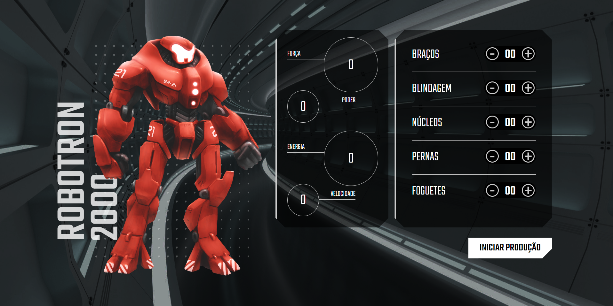

# Robotron 2000
Projeto desenvolvido durante o curso <b>"JavaScript: manipulando o DOM"</b> da Alura, que consiste na criação de uma interface para produção de robôs do tipo Robotron 2000 utilizando <b>HTML, CSS e JavaScript</b>. Para isso, foram aplicados conhecimentos como:

- manipulação de DOM
- querySelector()
- arrow functions
- objetos
- data attributes
- addEventListener
- onclick
- forEach

Com base no projeto inicial proposto, ainda adicionei diferenciais ao meu trabalho final de acaordo com os desafios propostos pelo instrutor:
- Tela de fundo personalizada
- Troca de cor do robô ao ser clicado

# <a href="https://ajuteixeira.github.io/robotron-2000/">Clique aqui para acessar o gerador de Robotron 2000 :)</a>